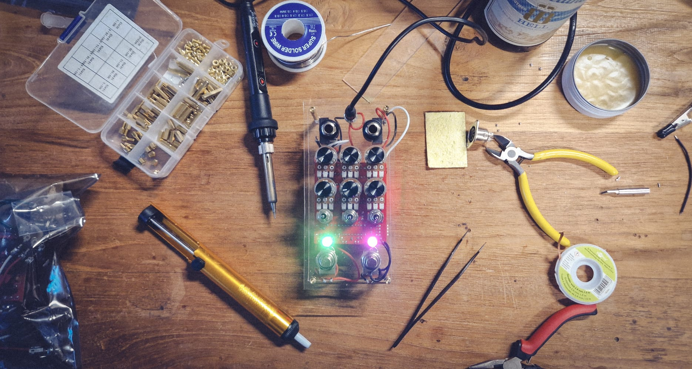

# FunBox Experiments



Those are some experiments I'm doing with my custom build of [FunBox](https://github.com/GuitarML/FunBox) guitar pedal. The manuals for building and flashing are for Linux. Building it on a mac should be exactly the same, but flashing probably not. No idea how to do that on Windows, but on WSL should be exactly the same steps.

## Building

This project uses `nix-shell` to create a development environment. Assuming it's available, building it is as simple as running:

```shell
nix-shell --run "make"
```

This will build all the experiments.

## Developing

Once in the `nix-shell`, it will build the project and generate `compile-commands.json` to use with `clangd` LSP. Unfortunately I wasn't able to remove all the errors it's reporting, I guess it's something related to the fact that we're not actually building this project with clang. But all in all, it's really useful.

## Flashing Daisy Seed

This is a bit more tricky. There's a way to flash it from the shell straight with `make program-dfu` in each experiment. However, it's necessary to have the correct `udev` rules on the host system. I couldn't get it working from within the `nix-shell`, without having `dfu-util` also installed on my host system.

Another way would be having all that in a container running its own `udev`, but I think you'd still need some rule on the host to pass-through. I'll try that later at some point.
